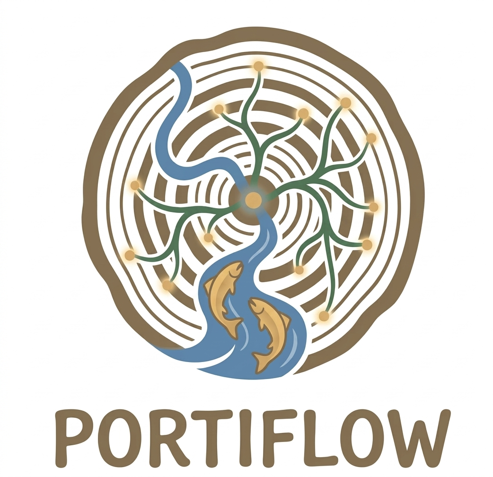

<div align="center">



# PORTIFLOW

**Your Portfolio, Flowing Smart**

[](https://www.python.org/downloads/)
[](https://opensource.org/licenses/MIT)
[](https://github.com/psf/black)

*A comprehensive framework for intelligent portfolio analysis, backtesting, and visualization*

[Features](#features) • [Quick Start](#quick-start) • [Documentation](#documentation) • [Examples](#examples) • [License](#license)

</div>

---

## 🌊 What is PORTIFLOW?

PORTIFLOW is a production-ready Python framework designed for quantitative portfolio analysis and optimization. Built with modern software engineering practices, it provides institutional-grade tools for asset allocation, risk management, and performance attribution.

### Why PORTIFLOW?

- **🎯 Intelligent**: Smart asset allocation algorithms and risk-adjusted metrics
- **⚡ Efficient**: Modular architecture with clean separation of concerns
- **📊 Visual**: Publication-quality charts and comprehensive analytics
- **🔧 Flexible**: Easy configuration and extensible design
- **🚀 Production-Ready**: Type hints, error handling, and comprehensive documentation

---

## ✨ Features

### Core Capabilities

- **Multi-Asset Support**: Analyze 14+ global assets across equities, bonds, commodities, and crypto
- **7 Pre-configured Strategies**: From conservative to aggressive portfolio allocations
- **Advanced Metrics**: Sharpe, Sortino, Calmar ratios, VaR, maximum drawdown, and more
- **Professional Visualizations**: 10+ publication-quality charts with customizable styling
- **Backtesting Engine**: Robust historical performance analysis with detailed attribution

### Supported Assets

| Category | Assets |
|----------|--------|
| **China Markets** | CSI300, Hang Seng Index |
| **US Markets** | S&P 500, Nasdaq 100 |
| **International** | Nikkei 225, Euro STOXX 50 |
| **Fixed Income** | US Treasury ETF, China 10Y Bonds |
| **Commodities** | Gold, WTI Crude Oil, Industrial Metals |
| **Alternatives** | REITs, Bitcoin |

### Portfolio Strategies

1. **Rate Cut Cycle** - Optimized for declining interest rate environments
2. **AI & Technology** - Concentrated exposure to innovation leaders
3. **China Recovery** - Positioned for Chinese economic expansion
4. **Global Equity** - Diversified international stock allocation
5. **Balanced** - Risk-managed multi-asset approach
6. **Equal Weight** - Passive diversification baseline
7. **60/40 Classic** - Traditional stock-bond allocation

---

## 🚀 Quick Start

### Installation

```bash
# Clone the repository
git clone https://github.com/yourusername/PORTIFLOW.git
cd PORTIFLOW

# Install dependencies
pip install -r requirements.txt
```

### Run Analysis

```bash
# Execute complete portfolio analysis
python main.py
```

This will:
1. Load and align asset data
2. Backtest all portfolio strategies
3. Calculate performance metrics
4. Generate visualizations
5. Export results to CSV

### Output

- **Results**: `results/backtest_summary.csv` - Performance metrics for all portfolios
- **Charts**: `visualization/*.png` - 10+ professional visualizations
- **Details**: `results/*_details.csv` - Daily portfolio data

---

## 📊 Performance Metrics

PORTIFLOW calculates comprehensive performance indicators:

| Metric | Description |
|--------|-------------|
| **Total Return** | Absolute and percentage gains |
| **Annualized Return** | CAGR over the analysis period |
| **Volatility** | Standard deviation of returns |
| **Sharpe Ratio** | Risk-adjusted return metric |
| **Sortino Ratio** | Downside risk-adjusted return |
| **Maximum Drawdown** | Largest peak-to-trough decline |
| **Calmar Ratio** | Return divided by max drawdown |
| **Win Rate** | Percentage of positive return days |
| **VaR 95%** | Value at Risk at 95% confidence |

---

## 🎨 Visualizations

PORTIFLOW generates professional-grade charts:

- **Correlation Heatmap** - Asset relationship analysis
- **Portfolio Values** - Net asset value over time
- **Drawdown Curves** - Underwater equity visualization
- **Cumulative Returns** - Return accumulation tracking
- **Efficient Frontier** - Risk-return optimization
- **Performance Metrics** - Comparative bar charts
- **Asset Allocations** - Portfolio composition pie charts
- **Returns Distribution** - Statistical distribution analysis
- **Rolling Sharpe** - Time-varying risk-adjusted performance
- **Monthly Heatmap** - Calendar view of returns

---

## 📁 Project Structure

```
PORTIFLOW/
├── main.py                 # Main execution entry point
├── src/                    # Core modules
│   ├── config.py          # Configuration and parameters
│   ├── data_loader.py     # Data loading and preprocessing
│   ├── backtest_engine.py # Portfolio backtesting
│   └── visualizer.py      # Chart generation
├── data/                   # Asset price data (CSV)
├── results/                # Analysis outputs
├── visualization/          # Generated charts
├── examples/               # Usage examples
│   ├── data_analysis_example.py
│   └── custom_portfolio_example.py
└── requirements.txt        # Python dependencies
```

---

## 🔧 Configuration

### Custom Portfolios

Edit `src/config.py` to create your own strategies:

```python
PORTFOLIOS = {
    'My Strategy': {
        'SPX': 0.50,    # 50% S&P 500
        'GLD': 0.30,    # 30% Gold
        'TLT': 0.20,    # 20% Bonds
    }
}
```

### Parameters

Adjust analysis settings in `src/config.py`:

```python
INITIAL_CAPITAL = 1_000_000  # Starting capital
START_DATE = '2025-01-01'    # Analysis start
END_DATE = '2025-12-31'      # Analysis end
RISK_FREE_RATE = 0.02        # Risk-free rate (2%)
```

---

## 📚 Examples

### Analyze Asset Correlations

```bash
python examples/data_analysis_example.py
```

### Backtest Custom Portfolio

```bash
python examples/custom_portfolio_example.py
```

### Programmatic Usage

```python
from src.data_loader import DataLoader
from src.backtest_engine import BacktestEngine

# Load data
loader = DataLoader()
loader.load_all_assets()
data, dates = loader.align_data()

# Backtest portfolio
engine = BacktestEngine()
portfolio = {'Tech Focus': {'NDX': 0.7, 'SPX': 0.3}}
engine.backtest_all_portfolios(portfolio, data)

# Get results
metrics = engine.portfolio_metrics['Tech Focus']
print(f"Sharpe Ratio: {metrics.sharpe_ratio:.2f}")
```

---

## 🛠️ Requirements

- Python 3.8+
- pandas >= 2.0.0
- numpy >= 1.24.0
- matplotlib >= 3.7.0
- seaborn >= 0.12.0
- scipy >= 1.10.0

See `requirements.txt` for complete dependencies.

---

## 📖 Documentation

### Data Format

CSV files should contain:
- `Date` column in MM/DD/YYYY format
- `Price` column with closing prices

### Adding New Assets

1. Add CSV file to `data/` directory
2. Update `ASSET_FILE_MAPPING` in `src/config.py`
3. Run analysis

### Extending Metrics

1. Add field to `PortfolioMetrics` in `src/backtest_engine.py`
2. Implement calculation in `calculate_metrics()`
3. Update visualization if needed

---

## 🤝 Contributing

Contributions are welcome! Please feel free to submit a Pull Request.

1. Fork the repository
2. Create your feature branch (`git checkout -b feature/AmazingFeature`)
3. Commit your changes (`git commit -m 'Add AmazingFeature'`)
4. Push to the branch (`git push origin feature/AmazingFeature`)
5. Open a Pull Request

---

## 📄 License

This project is licensed under the MIT License - see the [LICENSE](LICENSE) file for details.

---

## 🙏 Acknowledgments

- Modern Portfolio Theory by Harry Markowitz
- Sharpe Ratio by William F. Sharpe
- Open source community for excellent tools and libraries

---

## 📧 Contact

For questions, suggestions, or collaboration opportunities, please open an issue on GitHub.

---

<div align="center">

**Built with ❤️ for intelligent portfolio management**

[⬆ Back to Top](#portiflow)

</div>
